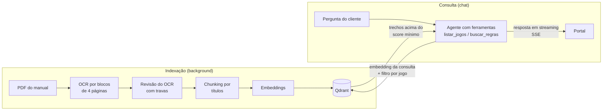

# Próximo Turno API

Backend da **Próximo Turno**, locadora de jogos de tabuleiro. A API cuida do catálogo, dos clientes, dos pedidos de aluguel, dos contratos com assinatura eletrônica e do **assistente de regras**: um chat com IA baseado em **RAG** (*Retrieval-Augmented Generation*) que responde dúvidas usando os manuais oficiais de cada jogo.

O frontend é o [Próximo Turno Portal](https://github.com/rafaelevoinfo/proximo-turno) (Next.js).

## Sumário

- [Funcionalidades](#funcionalidades)
- [Tecnologias](#tecnologias)
- [Arquitetura](#arquitetura)
- [Assistente de regras (RAG)](#assistente-de-regras-rag)
- [Executando](#executando)
- [Variáveis de ambiente](#variáveis-de-ambiente)
- [Migrations](#migrations)
- [Testes](#testes)
- [Documentação de design](#documentação-de-design)

## Funcionalidades

- **Catálogo:** jogos, cópias físicas (com status de manutenção e de uso só em eventos), fotos, links, categorias e tags. Também traz os jogos mais alugados e as novidades.
- **Clientes e contas:** ASP.NET Core Identity com tokens Bearer, ativação de conta, redefinição de senha e exclusão de conta (LGPD).
- **Pedidos:** criação, entrega, devolução por item, renovação, cancelamento e cupons de desconto.
- **Contratos:** PDF gerado de forma assíncrona (PuppeteerSharp) e assinatura eletrônica via **Autentique**, com webhook de retorno.
- **Comentários e avaliações**, lista de desejos e notificações por e-mail (MailKit).
- **Assistente de regras (RAG):** indexação dos manuais em PDF e chat com IA, com créditos por cliente. Veja [a seção dedicada](#assistente-de-regras-rag).
- **Auditoria de IA:** cada chamada a LLM ou embedding é registrada com tokens e custo. Há relatórios de custo e auditoria das conversas do chat.
- **Operação:** relatório de faturamento, leitura dos logs pela API, health check e **backup automatizado** criptografado do MySQL para a Backblaze B2 (detalhes em [DOCKER.md](DOCKER.md#backup-automatizado)).

## Tecnologias

| Área | Tecnologia |
| --- | --- |
| Framework | .NET 10 / ASP.NET Core Web API |
| Banco de dados | MySQL + Entity Framework Core (`MySql.EntityFrameworkCore`) |
| Autenticação | ASP.NET Core Identity (API endpoints, Bearer token) |
| Validação | Flunt (notification pattern) |
| Logs | Serilog (arquivo, com trace id por requisição e por job em background) |
| Imagens | Cloudinary |
| Contratos | PuppeteerSharp (PDF) + Autentique (assinatura) |
| Backup | AWS SDK S3 (Backblaze B2) |
| IA | Microsoft.Extensions.AI, Microsoft Agent Framework e OpenRouter |
| Vector store | Qdrant (gRPC) |
| PDF | PdfPig (divisão de páginas e camada de texto) |
| Testes | xUnit |

## Arquitetura

```
Src/
  Application/
    Controllers/   Endpoints HTTP
    UseCases/      Regras de negócio (herdam de UseCaseBasico, validação com Flunt)
      RAG/         Indexação dos manuais
      Chat/        Assistente de regras
      IA/          Escopo e registro de uso de LLM
    Workers/       Serviços em background (indexação de manuais)
    DTOs/
  Domain/          Constantes e regras de domínio (inclui IAModels.cs)
  Infrastructure/
    Models/        Entidades do EF Core
    Repositories/  Acesso a dados (Repository pattern)
    RAG/           OCR, revisão, embeddings e Qdrant
    IA/            Fábrica de clientes OpenRouter, ledger de uso, cotação do dólar
    Services/      Cloudinary, e-mail, Autentique, PDF de contrato
    Backup/
  Migrations/
Tests/             Testes xUnit (Domain, Infrastructure, Fakes)
docs/superpowers/  Specs de design e planos de implementação
```

Convenções: a lógica de negócio fica nos use cases, registrados como `Scoped` em `Program.cs`. O acesso a dados passa por repositórios. Endpoints protegidos usam `[Authorize]`.

## Assistente de regras (RAG)

O assistente responde **somente** dúvidas de regras dos jogos do catálogo. Toda resposta se apoia em trechos do manual do jogo, recuperados por busca vetorial, nunca na memória do modelo. Se o manual não cobre a dúvida, ele diz isso e sugere consultar o manual completo.



### Indexação dos manuais

Os manuais são links do tipo **Regra** de cada jogo, com o PDF enviado por `POST /api/upload/manual`. Quando um link é criado ou alterado, ou quando o admin chama `POST /api/jogos/{id}/reindexar-manuais`, o link entra numa fila em memória (`ManualQueue`). O `IndexacaoManuaisWorker` consome a fila **um manual por vez**, para que a extração não dispute o próprio rate limit. Na inicialização, o worker também enfileira o que ficou pendente e remove do Qdrant os vetores que não deveriam mais estar lá (link apagado, jogo desativado, link que deixou de ser de regra).

O job carrega só ids: `SincronizarManual` lê o estado atual do banco e decide o que fazer. Por isso, um job repetido ou antigo na fila não causa dano.

1. **Deduplicação por conteúdo.** O PDF é identificado pelo SHA-256. Se outro link do mesmo jogo já indexou o mesmo arquivo, o link vira *Duplicado* e nada é pago de novo. O Markdown extraído fica em cache por hash (`{hash}.raw.md` e `{hash}.md`) na pasta de uploads. Se o mesmo PDF for reenviado com outro nome, a extração é reaproveitada.
2. **OCR com LLM multimodal** (`PdfTextExtractor`):
   - O PDF é dividido em blocos de 4 páginas, extraídos em paralelo (até 3 de cada vez). Pedir o manual inteiro de uma vez fazia o modelo resumir sem avisar.
   - Cada bloco recebe uma nota. Se a página tem camada de texto, a nota é a **cobertura**: quanto das palavras do PDF (lidas com PdfPig) aparece no Markdown. Sem camada de texto, vale a nota de confiabilidade que o próprio modelo informa.
   - Nota acima de 80: o bloco é aceito. Abaixo disso, o bloco passa para o próximo modelo da cascata `IAModel.OCR_MODELS`. Com nota de 50 ou menos, vai direto para o último, o mais forte.
   - Se um bloco falhar, a extração inteira falha. Um manual com páginas faltando é justamente o defeito que a divisão em blocos existe para evitar.
3. **Revisão do OCR** (`LlmMarkdownRevisor` + `RevisaoMarkdown`). Um modelo barato propõe correções de erros de leitura. O modelo só sugere: o que entra é decidido por travas determinísticas.
   - O trecho tem de existir no texto e a correção não pode mudar nenhum número.
   - A distância de edição vai de 1 a 2, e o trecho tem no máximo 3 palavras.
   - Ficam protegidas as palavras curtas, as do nome do jogo ou do manual e os termos usados 3 ou mais vezes no manual, que provavelmente são vocabulário do jogo.
   - Se a revisão falhar inteira, o texto do OCR é indexado mesmo assim.
4. **Chunking por títulos** (`ChunkingExtractor`):
   - O Markdown é dividido pela hierarquia de títulos ATX. Cada seção vira um trecho do tamanho que tem; só as maiores que 2.000 caracteres são partidas, com 200 de sobreposição. Seções menores que 300 caracteres são fundidas à anterior.
   - O texto vetorizado inclui o jogo, o manual e o caminho de títulos (`Azul > Turno > Pegar peças`). Assim, um trecho isolado continua dizendo de que regra fala.
5. **Embeddings + Qdrant:**
   - Os trechos são vetorizados em lotes de até 32 (`EmbeddingExtractor`). Se o provedor devolver menos vetores que trechos, a indexação falha, em vez de gravar vetores no trecho errado.
   - Todos os jogos ficam numa coleção única, com distância de cosseno e `IdJogo`, `IdJogoLink`, título e texto no payload. Desenvolvimento usa a coleção `manuais_dev`, para não mexer na de produção (`manuais`).

**Estados de um link** (`JogoLinkIndexacao`): *Processando*, *Indexado*, *Duplicado*, *Falhou* e *Removido*.

- Enquanto um manual é reprocessado, os vetores antigos saem da busca. Um manual trocado não pode seguir respondendo com a versão anterior se a nova falhar.
- Depois de 3 falhas na mesma URL, o link só volta à fila se o PDF mudar ou se a reindexação for forçada. Forçar descarta o cache de extração e de revisão daquele PDF.
- Quando o link que tinha o PDF original sai de cena, os *Duplicados* do mesmo jogo voltam para a fila.

### Consulta (chat)

`POST /api/chat/mensagens` (`ResponderPerguntaRegras`) responde em **Server-Sent Events** (`SaidaSse`):

1. **Validação e crédito:** a pergunta tem no máximo 500 caracteres, e o saldo do usuário é verificado **antes** de qualquer gasto.
2. **Agente** (Microsoft Agent Framework, temperatura 0,2), com duas ferramentas (`FerramentasChat`):
   - `listar_jogos`: o catálogo com id, nome e `temManual`. O modelo usa para identificar o jogo citado, mesmo com apelido ou erro de digitação.
   - `buscar_regras(idJogo, consulta)`: gera o embedding da consulta e busca no Qdrant **sempre filtrado por um único jogo**, com uma segunda conferência do `IdJogo` no payload. Traz até 6 trechos e só repassa ao modelo os que têm similaridade de pelo menos `CHAT_SCORE_MINIMO` (padrão 0,30).
3. **Contexto da página:** se o cliente abriu o chat na página de um jogo, esse jogo entra nas instruções e é usado quando ele não citar outro.
4. **Streaming:** o texto vai para o cliente à medida que é gerado. Quando o modelo chama uma ferramenta depois de já ter escrito algo, a API emite um evento de "consultando", para a tela não parecer travada.
5. **Memória:** a sessão do agente é gravada no banco a cada turno, só com as mensagens do usuário e do assistente. Chamadas e resultados de ferramenta ficam fora, para não encarecer as perguntas seguintes. Acima de 40 mensagens, as antigas são resumidas e as 20 mais recentes ficam inteiras (`SummarizingChatReducer`).

**Proteções:**

- **Instruções restritas a regras de jogo:** o assistente recusa outros assuntos, ignora pedidos para mudar ou revelar as instruções e nunca expõe ids nem nomes de ferramentas.
- **Limites:** no máximo 4 chamadas de ferramenta por pergunta e 10 perguntas por minuto por usuário (rate limiter, resposta 429).
- **Isolamento das conversas:** uma conversa só pode ser continuada pelo próprio dono. Chave desconhecida ou de outro usuário começa uma conversa nova.
- **Registro de cada turno:** a tabela `CHAT_MENSAGEM` guarda as ferramentas chamadas e **todos os trechos recuperados, com score e se foram usados**. Isso permite auditar se o modelo buscou antes de responder e calibrar o corte de similaridade.

### Custos e créditos

- **Ponto único de criação dos clientes:** todo cliente de LLM e de embedding nasce na `FabricaOpenRouter`, que instala a `PoliticaUsoLlm`. Assim, cada tentativa de chamada vira uma linha no ledger `USO_LLM`, com operação (OCR, revisão, embedding, resposta do chat, embedding do chat, resumo), modelo, tokens e custo.
- **Atribuição do gasto:** o `EscopoUsoLlm` diz a quem o gasto pertence: jogo, link de manual e, no chat, o usuário.
- **Saldo do cliente:** é calculado na hora, sem tabela de saldo. É um bônus de boas-vindas (`CHAT_BONUS_USD`, convertido para reais pela cotação da AwesomeAPI) mais um percentual do valor base dos aluguéis (`CHAT_PERCENTUAL_CREDITO`), menos o gasto registrado. Um aluguel novo já renova o crédito. Admins não têm limite.

### Modelos

Definidos em `Src/Domain/IAModels.cs` e acessados via OpenRouter:

| Uso | Constante |
| --- | --- |
| OCR (cascata, do mais barato ao mais forte) | `IAModel.OCR_MODELS` |
| Revisão do OCR | `IAModel.REVISOR_MODEL` |
| Embeddings (indexação e consulta) | `IAModel.EMBEDDING_MODEL` |
| Resposta e resumo do chat | `IAModel.CHAT_RESPOSTA_MODEL` |

### Endpoints do RAG

| Método | Rota | Descrição |
| --- | --- | --- |
| `POST` | `/api/upload/manual` | Upload do PDF de um manual |
| `POST` | `/api/jogos/{id}/reindexar-manuais` | Força a reindexação dos manuais do jogo |
| `GET` | `/api/jogos/admin/manuais/{idJogoLink}/markdown` | Markdown gerado, revisado ou OCR bruto (`?versao=`) |
| `POST` | `/api/chat/mensagens` | Pergunta ao assistente (resposta em SSE) |
| `GET` | `/api/chat/creditos/cliente/{idCliente}` | Saldo de um cliente (admin) |
| `GET` | `/api/ia/requisicoes` | Ledger de chamadas a LLM (admin) |
| `GET` | `/api/ia/conversas`, `/api/ia/conversas/{chave}` | Auditoria das conversas do chat (admin) |
| `GET` | `/api/relatorios/custos-ia` | Relatório de custos de IA (admin) |

## Executando

### Pré-requisitos

- .NET 10 SDK
- MySQL (ou Docker)
- Uma chave da [OpenRouter](https://openrouter.ai) e uma instância do [Qdrant](https://qdrant.tech), necessárias para o RAG

### Local

```bash
cp Src/.env.example Src/.env     # ajuste os valores
dotnet restore
dotnet run --project Src/ProximoTurnoApi.csproj
```

- API: `http://localhost:5016`
- Swagger UI (só em Development): `/swagger`, a partir de `/openapi/v1.json`
- Health check: `/health`

Em Development, o `DotNetEnv` carrega o `.env` automaticamente.

### Docker

```bash
docker compose up --build -d
```

O compose sobe três serviços:

- `proximoturno-mysql`: MySQL, exposto em `127.0.0.1:3308`;
- `proximoturno-migrations`: aplica as migrations e encerra;
- `proximoturno-api`: a API, na porta 80 do container.

Todos ficam na rede `proximoturno-network`, a mesma que o frontend usa para alcançar a API em `http://proximoturno-api`. A API não publica porta no host.

## Variáveis de ambiente

O modelo está em `Src/.env.example`.

| Variável | Uso |
| --- | --- |
| `MYSQL_ROOT_PASSWORD`, `MYSQL_DATABASE`, `MYSQL_USER`, `MYSQL_PASSWORD` | Banco de dados |
| `CLOUDINARY_URL` | Upload de imagens |
| `SMTP_HOST`, `SMTP_PORT`, `SMTP_USERNAME`, `SMTP_PASSWORD`, `SMTP_USE_SSL`, `SMTP_FROM_NAME` | E-mail |
| `AUTENTIQUE_API_TOKEN`, `AUTENTIQUE_SANDBOX`, `AUTENTIQUE_WEBHOOK_SECRET` | Assinatura de contratos |
| `OPENROUTER_API_KEY` | LLMs e embeddings do RAG |
| `QDRANT_URL`, `QDRANT_API_KEY` | Vector store dos manuais |
| `CHAT_PERCENTUAL_CREDITO` | Fração do valor dos aluguéis que vira crédito do chat (padrão `0.10`) |
| `CHAT_BONUS_USD` | Crédito de boas-vindas em dólar (padrão `0.50`) |
| `CHAT_SCORE_MINIMO` | Similaridade mínima para um trecho ir ao modelo (padrão `0.30`) |
| `COTACAO_USD_BRL_PADRAO` | Cotação usada quando a AwesomeAPI não responde (padrão `5.50`) |
| `BACKUP_*`, `B2_*` | Backup automatizado ([DOCKER.md](DOCKER.md#backup-automatizado)) |

Sem `OPENROUTER_API_KEY`, a API sobe normalmente e só a indexação e o chat falham. Sem as variáveis do Qdrant, falham as funcionalidades que dependem do vector store.

## Migrations

```bash
dotnet ef migrations add <NomeDaMigration> --project Src/ProximoTurnoApi.csproj
dotnet ef database update --project Src/ProximoTurnoApi.csproj
```

No Docker, as migrations rodam automaticamente pelo serviço `migrations` antes da API subir.

## Testes

```bash
dotnet test Tests/Tests.csproj
```

Os testes cobrem, entre outros:

- os use cases de pedido, cupom e contrato;
- o pipeline do RAG: extração por blocos, revisão, chunking, embeddings, sincronização, worker e vector store;
- o chat de regras, o saldo de créditos e o ledger de uso de LLM.

## Documentação de design

As specs e os planos de cada funcionalidade ficam em `docs/superpowers/`. Para o RAG:

- `specs/2026-09-15-indexacao-manuais-design.md`: indexação dos manuais
- `specs/2026-09-24-uso-llm-design.md`: ledger de uso e custos de LLM
- `specs/2026-09-26-chat-regras-design.md`: assistente de regras

O procedimento de restauração do backup está em `docs/RESTORE.md`.
