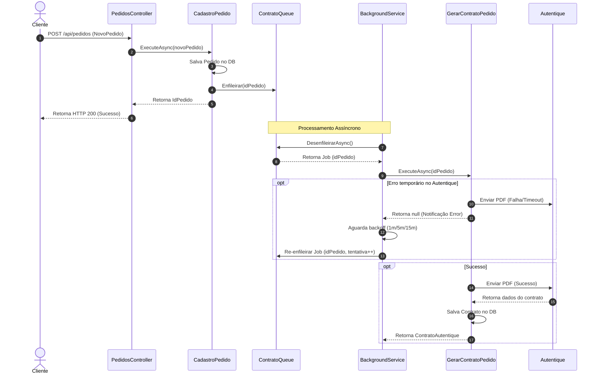

# Especificação de Design: Geração de Contrato Assíncrona

## Histórico de Revisões
- **Data:** 16/06/2026
- **Status:** Em Revisão
- **Autor:** Antigravity (AI Coding Assistant)

---

## 1. Visão Geral
Atualmente, a geração de contratos com o serviço externo Autentique ocorre de forma síncrona/manual através da rota do `ContratosController`. Para garantir que todo pedido possua um contrato gerado sem impactar a performance ou disponibilidade da finalização do pedido, este design propõe a execução assíncrona em segundo plano logo após a criação de um pedido, utilizando uma fila em memória robusta e lógica de retentativas progressivas para falhas do serviço externo.

---

## 2. Requisitos e Premissas
- **Transação Assíncrona:** A finalização do pedido (retorno do endpoint `POST /api/pedidos`) não deve aguardar a chamada ao Autentique.
- **Resiliência a Falhas:** Se o Autentique estiver fora do ar ou oscilando, o sistema deve tentar re-enviar o contrato automaticamente com atrasos crescentes (1 min, 5 min, 15 min).
- **Sem Falso Positivo para Falhas de Negócio:** Se a geração falhar por erro de validação (ex: pedido não encontrado ou status inválido), o sistema não deve tentar novamente.
- **Tratamento de Escopo:** O serviço de background (Singleton) deve resolver corretamente o Use Case `GerarContratoPedido` (Scoped) criando um escopo temporário do container de DI (`IServiceScopeFactory`).

---

## 3. Arquitetura e Fluxo de Dados

O diagrama abaixo ilustra o fluxo desde a criação do pedido até a geração do contrato em segundo plano:



---

## 4. Detalhes das Implementações

### 4.1. Estrutura de Mensagem
Criaremos a classe `ContratoJob` no namespace `ProximoTurnoApi.Application.UseCases` (ou similar) para rastrear o progresso do processamento.

```csharp
namespace ProximoTurnoApi.Application.UseCases;

public class ContratoJob
{
    public int IdPedido { get; }
    public int Tentativas { get; set; }

    public ContratoJob(int idPedido, int tentativas = 0)
    {
        IdPedido = idPedido;
        Tentativas = tentativas;
    }
}
```

### 4.2. Interface e Implementação da Fila
A fila gerenciará os jobs de forma thread-safe usando `System.Threading.Channels`.

```csharp
using System.Threading;
using System.Threading.Tasks;

namespace ProximoTurnoApi.Application.UseCases;

public interface IContratoQueue
{
    void Enfileirar(int idPedido, int tentativa = 0);
    ValueTask<ContratoJob> DesenfileirarAsync(CancellationToken cancellationToken);
}
```

Implementação em `ContratoQueue.cs`:
```csharp
using System.Threading;
using System.Threading.Channels;
using System.Threading.Tasks;

namespace ProximoTurnoApi.Application.UseCases;

public class ContratoQueue : IContratoQueue
{
    private readonly Channel<ContratoJob> _channel;

    public ContratoQueue()
    {
        // Fila sem limite de capacidade (unbounded) para evitar bloqueio ao enfileirar
        _channel = Channel.CreateUnbounded<ContratoJob>(new UnboundedChannelOptions
        {
            SingleReader = true, // Apenas o BackgroundService lê da fila
            SingleWriter = false // Múltiplas requisições HTTP podem escrever simultaneamente
        });
    }

    public void Enfileirar(int idPedido, int tentativa = 0)
    {
        _channel.Writer.TryWrite(new ContratoJob(idPedido, tentativa));
    }

    public ValueTask<ContratoJob> DesenfileirarAsync(CancellationToken cancellationToken)
    {
        return _channel.Reader.ReadAsync(cancellationToken);
    }
}
```

### 4.3. Worker de Background
Implementação de `ContratoQueueBackgroundService` herdando de `BackgroundService`.

```csharp
using System;
using System.Linq;
using System.Threading;
using System.Threading.Tasks;
using Microsoft.Extensions.DependencyInjection;
using Microsoft.Extensions.Hosting;
using Microsoft.Extensions.Logging;

namespace ProximoTurnoApi.Application.UseCases;

public class ContratoQueueBackgroundService : BackgroundService
{
    private readonly IContratoQueue _queue;
    private readonly IServiceScopeFactory _scopeFactory;
    private readonly ILogger<ContratoQueueBackgroundService> _logger;

    private static readonly TimeSpan[] DelaysRetentativa = 
    {
        TimeSpan.FromMinutes(1),
        TimeSpan.FromMinutes(5),
        TimeSpan.FromMinutes(15)
    };

    public ContratoQueueBackgroundService(
        IContratoQueue queue,
        IServiceScopeFactory scopeFactory,
        ILogger<ContratoQueueBackgroundService> logger)
    {
        _queue = queue;
        _scopeFactory = scopeFactory;
        _logger = logger;
    }

    protected override async Task ExecuteAsync(CancellationToken stoppingToken)
    {
        _logger.LogInformation("ContratoQueueBackgroundService iniciado.");

        while (!stoppingToken.IsCancellationRequested)
        {
            try
            {
                var job = await _queue.DesenfileirarAsync(stoppingToken);
                _logger.LogInformation("Job de geração de contrato para o pedido {IdPedido} retirado da fila.", job.IdPedido);

                // Executa em segundo plano sem bloquear a leitura dos próximos itens
                _ = ProcessarJobAsync(job, stoppingToken);
            }
            catch (OperationCanceledException)
            {
                // Aplicação parando
                break;
            }
            catch (Exception ex)
            {
                _logger.LogError(ex, "Erro no loop principal do serviço de fila de contratos.");
            }
        }

        _logger.LogInformation("ContratoQueueBackgroundService finalizado.");
    }

    private async Task ProcessarJobAsync(ContratoJob job, CancellationToken stoppingToken)
    {
        try
        {
            using var scope = _scopeFactory.CreateScope();
            var gerarContratoUseCase = scope.ServiceProvider.GetRequiredService<GerarContratoPedido>();

            var contrato = await gerarContratoUseCase.ExecuteAsync(job.IdPedido);

            if (!gerarContratoUseCase.IsValid)
            {
                var erroNotificacao = gerarContratoUseCase.Notifications.FirstOrDefault();
                
                // Se o erro for de validação/regra de negócio, não tentamos novamente
                if (erroNotificacao?.Type == UseCaseNotificationType.BadRequest || 
                    erroNotificacao?.Type == UseCaseNotificationType.NotFound)
                {
                    _logger.LogWarning("Falha de validação ao gerar contrato do pedido {IdPedido}: {Erro}. Nenhuma retentativa será agendada.", 
                        job.IdPedido, gerarContratoUseCase.AggregateErrors());
                    return;
                }

                // Se for um erro de integração ou de sistema (Error), forçamos fluxo de retentativa
                throw new Exception($"Falha de integração ao gerar contrato: {gerarContratoUseCase.AggregateErrors()}");
            }

            _logger.LogInformation("Contrato gerado e enviado com sucesso para o pedido {IdPedido}.", job.IdPedido);
        }
        catch (Exception ex)
        {
            _logger.LogError(ex, "Erro ao processar job de geração de contrato do pedido {IdPedido}. Tentativa: {Tentativas}", job.IdPedido, job.Tentativas);
            
            if (job.Tentativas < DelaysRetentativa.Length)
            {
                var delay = DelaysRetentativa[job.Tentativas];
                job.Tentativas++;

                _logger.LogInformation("Re-enfileirando geração de contrato do pedido {IdPedido} com delay de {Delay}.", job.IdPedido, delay);
                
                // Agenda o re-enfileiramento assíncrono não-bloqueante
                _ = Task.Run(async () =>
                {
                    try
                    {
                        await Task.Delay(delay, stoppingToken);
                        _queue.Enfileirar(job.IdPedido, job.Tentativas);
                    }
                    catch (OperationCanceledException)
                    {
                        // Aplicação parando, ignora
                    }
                }, stoppingToken);
            }
            else
            {
                _logger.LogError("Número máximo de tentativas excedido para a geração de contrato do pedido {IdPedido}.", job.IdPedido);
            }
        }
    }
}
```

### 4.4. Alterações no Use Case Existente (`CadastroPedido`)
Injetamos a fila no construtor de `CadastroPedido` e a notificamos ao concluir com sucesso:

```diff
 public class CadastroPedido(IPedidoRepository pedidoRepository,
     IJogoRepository _jogoRepository,
     IClienteRepository _clienteRepository,
     ICategoriaRepository _categoriaRepository,
     UserManager<Usuario> _userManager,
     ValidarCupom _validarCupom,
+    IContratoQueue _contratoQueue,
     ILogger<CadastroPedido> logger) : PedidoUseCaseBasico(pedidoRepository) {
 
     public async Task<int> ExecuteAsync(ClaimsPrincipal userClaim, NovoPedidoDTO novoPedidoDto) {
         ...
         try {
             await _pedidoRepository.SaveAsync(pedido);
             logger.LogInformation("Pedido {PedidoId} cadastrado com sucesso para o cliente {ClienteId}.", pedido.Id, cliente.Id);
+            
+            // Enfileira assincronamente a geração de contrato
+            _contratoQueue.Enfileirar(pedido.Id);
+            
             return pedido.Id;
         } catch (Exception ex) {
             logger.LogError(ex, "Erro fatal ao salvar o pedido no banco de dados.");
             throw;
         }
     }
```

---

## 5. Plano de Validação e Testes
1. **Teste Unitário/Integração para `ContratoQueue`**: Garantir que itens enfileirados sejam lidos corretamente em ordem FIFO e thread-safe.
2. **Teste de Integração do Fluxo Principal (`CadastroPedido` + `BackgroundService`)**:
   - Chamar o cadastro de pedido.
   - Confirmar que o pedido foi salvo com sucesso e o endpoint respondeu HTTP 200.
   - Confirmar que o background worker foi acionado e processou o contrato de forma independente.
3. **Teste de Simulação de Falha do Autentique**:
   - Simular falha temporária do serviço Autentique.
   - Verificar nos logs que o worker executou e detectou a falha, registrou a primeira tentativa e agendou a retentativa com delay correto.
